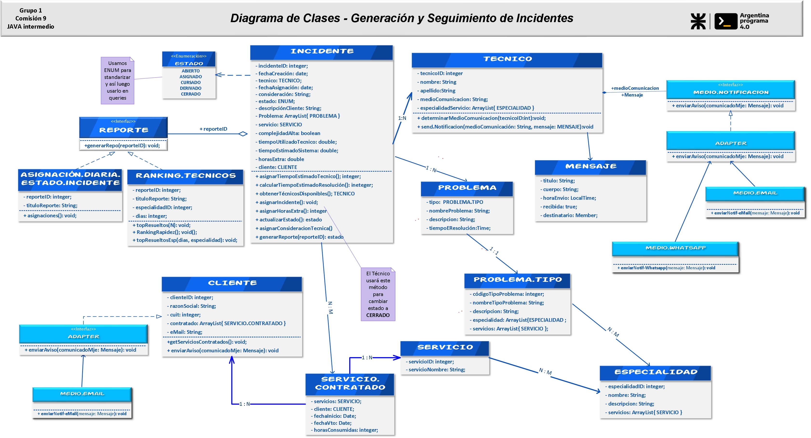

# __Reportes de Incidentes__  -  ___Comisión 9 / Grupo 1___
##  ___Entrega 1___ - Diagrama de Clases - Diagrama Entidad Relación - java maven 
## __Datos de la Presentación__

#### Fecha Primer Entrega: ` 18 de noviembre del 2023  `
>##### Integrantes por orden alfabético:
>* __`Kadyr Valdes`__
>* __`Pablo Gaboardi`__
>* __`Quimey Pullido`__
>* __`Arian Savall`__
>* __`Guillermo Escobar`__
>* __`Victor Gimenez`__

 

------

## Introducción
Una importante empresa de soporte operativo solicita el diseño y desarrollo de un sistema
que le permita la generación y seguimiento de los incidentes que se presentan.
La empresa en cuestión se dedica a brindar soporte operativo sobre distintas aplicaciones
(SAP, Tango, etc.) y sistemas operativos (Windows, MacOS, Linux Ubuntu).
El área de RRHH se encarga de realizar las altas, bajas y modificaciones de los técnicos que se
encargan de resolver los incidentes reportados.
Cada técnico tiene una o varias especialidades y solo se le pueden asignar incidentes que
coincidan con las mismas.
El área comercial es responsable de incorporar nuevos clientes a la empresa. Administra las
altas, bajas y modificaciones de los datos de cada uno de ellos.
Finalmente, la mesa de ayuda es responsable de atender las llamadas e ingresar al sistema los
incidentes reportados.
 
## Ciclo de vida de un incidente
Cuando un cliente llama, la mesa de ayuda le solicita los datos para identificarlo (razón social,
CUIT) y los ingresa en el sistema para que el mismo le muestre los servicios que el cliente
tiene contratados.
El operador (de la mesa de ayuda) solicita que le informen por cuál de esos servicios desea
reportar un incidente, junto con una descripción del problema y el tipo del problema.
Al ingresar el incidente, el sistema devuelve un listado de técnicos disponibles para resolver el
problema. El operador selecciona uno de los técnicos disponibles y el sistema le informa el
tiempo estimado de resolución. Luego, informa al cliente que el incidente ha sido ingresado y
la fecha posible de resolución.
Al confirmarse el incidente, el sistema debe enviar una notificación al técnico informándole
que tiene un nuevo incidente para resolver.

Cuando el técnico atiende y resuelve el incidente, lo debe marcar como “resuelto”, indicando
las consideraciones que crea necesarias. Cuando esto ocurra, el sistema debe enviar un email
al cliente informándole que su incidente ya está solucionado.
 
## Consideraciones:
El sistema debe permitir al área de RRHH emitir diariamente reportes con los
incidentes asignados a cada técnico y el estado de los mismos.
>* __El sistema debe permitir que el operador agregue “un colchón” de horas estimadas__
>para la resolución del problema, si el mismo es considerado “complejo”.
>* __El sistema debe permitir el alta de incidentes que contengan un conjunto de
>problemas de un mismo servicio. Dichos problemas deben estar relacionados__
>* __El sistema debe dar la posibilidad de informar: 
1.- Quién fue el técnico con más incidentes resueltos en los últimos N días 
2.- Quién fue el técnico con más incidentes resueltos de una determinada especialidad en los últimos N días 
3.- Quién fue el técnico que más rápido resolvió los incidentes __
> 
## Metodología:
Se propone una metodología de trabajo iterativa e incremental. Para esto, el TP se divide en
tres entregas, las cuales se realizarán a través del envío del link al repositorio de trabajo por
medio del Campus Virtual en la fecha estipulada por el Docente del curso.
En la última entrega (coincidente con la tercera) se deberá exponer el TP frente al curso,
mostrando la solución generada y justificando las decisiones tomadas
   

# **Diagrama de Clases** 

  

  

# __Diagrama de Entidad Relación__ 

  

